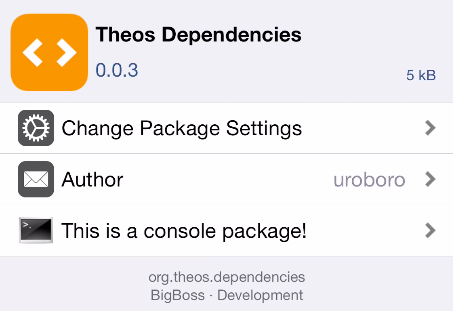
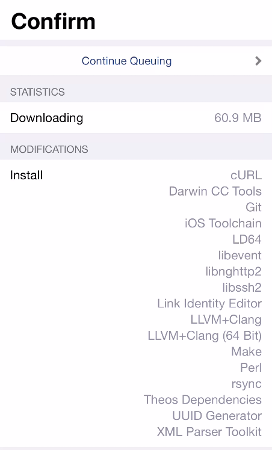
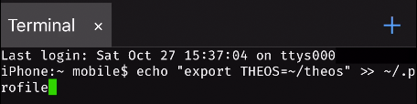

# Theos Installation

## macOS Installation

### Software Prerequisites

* OS X 10.9 \(Mavericks\)
* [Homebrew](https://brew.sh) 
* [Xcode](https://itunes.apple.com/us/app/xcode/id497799835?mt=12) $$^1$$ 

$$^1$$ Xcode 5.0 or newer is required.


Targets: **macOS**, **iOS**, **tvOS**, **watchOS**


### Installation

Open **Terminal.app** and paste the following command:



```bash
brew install ldid xz dpkg
```



Next, set up your THEOS ****environment ****variable by pasting this command:



```bash
echo "export THEOS=~/theos" >> ~/.profile
```



Let's clone the Theos repository to the folder we just created:



```bash
git clone --recursive https://github.com/theos/theos.git $THEOS
```



You can grab the latest iOS SDKS by pasting the next two commands:



```text
curl -LO https://github.com/theos/sdks/archive/master.zip
```





```text
unzip master.zip -d $THEOS/sdks
```



To finish the installation, set up a ghostbin script:



```bash
curl https://ghostbin.com/ghost.sh -o $THEOS/bin/ghost
```





```bash
chmod +x $THEOS/bin/ghost
```



## Windows/Linux Installation

### Software Prerequisites

#### Windows: 

* Windows Subsystem for Linux


Targets: **iOS**, **Linux**


#### - Windows/Linux:

Add the correct _clang-6.0 source_ for your Linux distro. Instructions can be found [here](http://apt.llvm.org/).



```bash
sudo apt-get update
```



Next, paste the following command:



```bash
sudo apt-get install fakeroot git perl clang-6.0 build-essential
```



Next, set up your THEOS ****environment ****variable by pasting this command:



```bash
echo "export THEOS=~/theos" >> ~/.profile
```



Let's clone the Theos repository to the folder we just created:



```bash
git clone --recursive https://github.com/theos/theos.git $THEOS
```



Next, we need the iOS toolchain. Paste the following commands, one by one:



```bash
curl https://kabiroberai.com/toolchain/download.php?toolchain=ios-linux -Lo toolchain.tar.gz 
```





```bash
tar xzf toolchain.tar.gz -C $THEOS/toolchain
```





```bash
rm toolchain.tar.gz
```



You can grab the latest iOS SDKS by pasting the next two commands:



```text
curl -LO https://github.com/theos/sdks/archive/master.zip
```





```text
unzip master.zip -d $THEOS/sdks
```



To finish the installation, set up a ghostbin script:



```bash
curl https://ghostbin.com/ghost.sh -o $THEOS/bin/ghost
```





```bash
chmod +x $THEOS/bin/ghost
```



## Other Installations

### iOS Installation

I placed the iOS installation as an _Other Installation_, as it seems impractical to use when writing a tweak. Tweak development includes debugging and disassembly at times, and \(for the most part\) these are not available on iOS.

#### Software Prerequisites

* Jailbroken iOS Device
* Cydia

Open Cydia and add the following sources**:**

* [https://coolstar.org/publicrepo](https://coolstar.org/publicrepo)
* [http://repo.bingner.com/](http://repo.bingner.com/) 

After adding the repos, search for _Theos Dependencies_ and install the package from the [BigBoss](https://apt.thebigboss.org/repofiles/cydia) repo.






Next, set up your THEOS ****environment ****variable by pasting this command in a Terminal:



```bash
echo "export THEOS=~/theos" >> ~/.profile
```





Let's clone the Theos repository to the folder we just created:



```bash
git clone --recursive https://github.com/theos/theos.git $THEOS
```



You can grab the latest iOS SDKS by pasting the next two commands:



```text
curl -LO https://github.com/theos/sdks/archive/master.zip
```





```text
unzip master.zip -d $THEOS/sdks
```



To finish the installation, set up a ghostbin script:



```bash
curl https://ghostbin.com/ghost.sh -o $THEOS/bin/ghost
```





```bash
chmod +x $THEOS/bin/ghost
```



## **Troubleshooting**

### Installing with zsh

* If you are using zsh, `echo "export THEOS=~/theos" >> ~/.profile` will not work because you are applying this to your bash profile rather than the zsh one.
* **Paste the following command to add the $THEOS location to zsh**:

```bash
echo "export THEOS=~/theos" >> ~/.zprofile
```


